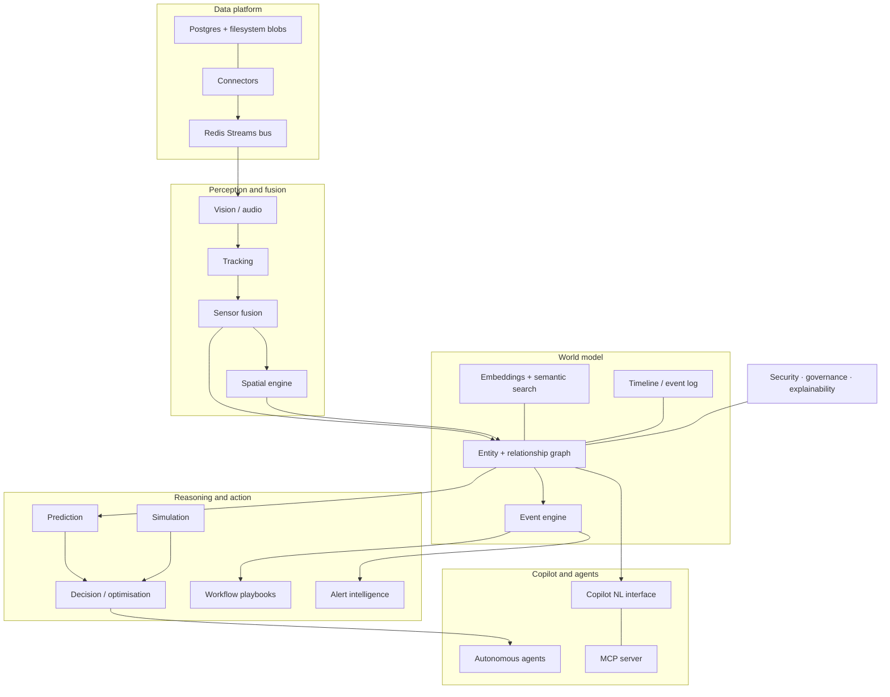
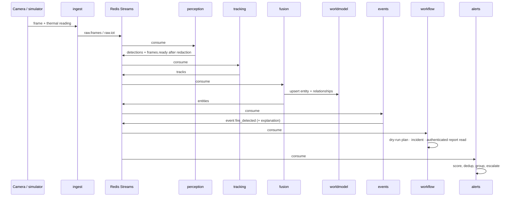

# SIO architecture

How the platform is put together, and why it is put together that way. The product definition
lives in [`PRD.md`](PRD.md); this document is the engineering view.

---

## 1. The shape of the thing

Signals arrive from connectors, become detections, become tracked objects, become *entities* in
a live spatiotemporal graph. Everything downstream — events, forecasts, decisions, agents, the
copilot, the UI — reads that graph rather than the raw feeds.

## 2. Ports and adapters

Every external engine sits behind a Protocol in `sio_core.ports`, and services obtain
implementations from `sio_core.registry`. **No service imports an adapter.** That rule is what
makes implemented adapters replaceable through configuration. Several GPU adapters remain
explicitly unimplemented; a port alone does not establish engine compatibility. The import boundary is enforced by
`tests/unit/test_architecture.py`, which walks the AST of `services/` and fails the build on a
forbidden import.

| Port | Adapters | Selector | Status |
|---|---|---|---|
| `Bus` | `RedisStreamBus`, `MemoryBus`, `KafkaBus` | `SIO_BUS_BACKEND` | Kafka: Phase 7 |
| `GraphStore` | `Neo4jGraphStore`, `PostgresGraphStore`, `MemoryGraphStore` | `SIO_GRAPH_BACKEND` | all live |
| `VectorStore` | `PgVectorStore`, `MemoryVectorStore`, `QdrantStore` | `SIO_VECTOR_BACKEND` | Qdrant: Phase 7 |
| `BlobStore` | `MinioBlobStore`, `FileBlobStore` | `SIO_BLOB_BACKEND` | both live |
| `Detector` | `OnnxYoloDetector`, `OnnxYoloSegDetector`, `FireHeuristicDetector`, `SyntheticDetector`, `DeepStreamDetector` | `SIO_DETECTOR` | Phase 2 |
| `Tracker` | `ByteTrackTracker`, `GeoTracker`, `BoxMotTracker` | `SIO_TRACKER` | Phase 2 |
| `Embedder` | `OnnxClipEmbedder`, `HashEmbedder` | `SIO_EMBEDDER` | Phase 2 |
| `Forecaster` | `StatsForecastForecaster`, `NaiveForecaster`, `TimesFMForecaster` | `SIO_FORECASTER` | Phase 3 |
| `LLM` | `OllamaLLM`, `OpenAICompatLLM`, `ScriptedLLM` | `SIO_LLM_PROVIDER` | Phase 4 |
| `PolicyEngine` | `EmbeddedPolicyEngine`, `OpaPolicyEngine`, `OpenFgaPolicyEngine` | `SIO_POLICY_ENGINE` | Phase 5 |
| `AuthProvider` | `DevJwtAuth`, `KeycloakOidcAuth` | `SIO_AUTH_MODE` | Phase 5 |
| `WorkflowRunner` | `InlineRunner`; `TemporalRunner` placeholder | `SIO_WORKFLOW_RUNNER` | inline active; Temporal rejects selection until implemented |

Every port has an in-memory or file-backed adapter. That is not a testing convenience bolted on
afterwards — it is why the unit ring needs no infrastructure, why `just check` passes on a
laptop with nothing installed, and why a developer can work on the event engine without running
Neo4j.

## 3. Data flow, concretely

The fire scenario, end to end:

Physical drone/gate adapters are not implemented. Approval records an operator's choice; it does
not itself execute a workflow or stamp the decision as physically executed.

One `trace_id` is attached at the frame and travels the whole way, including into the audit
log. That is what makes an explanation reconstructible after the fact rather than a
plausible-sounding summary.

## 4. Contracts

`libs/sio_schemas` owns every payload that crosses a service boundary. Rules that matter:

- **The wire format follows the PRD.** Where a PRD field name collides with a Python keyword
  (`class`, `from`, `to`), the attribute is renamed and an alias preserves the wire name.
  Serialisation always uses aliases.
- **Naive datetimes are rejected, never coerced.** Guessing the timezone of a sensor timestamp
  is how a replay window silently drifts by hours.
- **Identifiers are ULID-shaped and prefixed** (`det_01KYAQ…`). They sort by creation time,
  which the timeline relies on for tie-breaking.
- **`extra="forbid"`.** A typo in a producer is a loud error, not silent data loss.
- **Relationships are bitemporal.** Closing an edge sets `ts_valid_to`; nothing is deleted. That
  is the mechanism behind "reconstruct the world as it was at T".

JSON Schema exports live in [`schemas/`](schemas/) and are checked in CI, so a wire-format
change shows up as a schema diff in the pull request.

## 5. Storage

| Store | Holds | Why |
|---|---|---|
| Postgres + PostGIS | structured data, spatial geometry, timeline, audit, measurements | one transactional store for facts, and real spatial predicates |
| pgvector (same DB) | 512-d embeddings for frames, entities, ReID, agent memory | semantic retrieval requires a semantic model; default hash embeddings are deterministic placeholders |
| Postgres graph adapter (default), optional Neo4j | entity/relationship graph | default reuses the existing database; Neo4j is an optional engine |
| Redis Streams | the bus, plus the timeline tail | consumer groups, replayable history, one process |
| Filesystem (default), optional MinIO | frames, clips, masks, reports | local storage by default; MinIO adds S3-compatible storage |

Conventions in SQL: `tenant_id` leads every primary key and index (an index that does not would
make cross-tenant scans cheap); `payload jsonb` stores the canonical object losslessly while
scalar columns exist purely for filtering; BRIN on append-mostly time columns; HNSW cosine index
on embeddings.

**Immutability is enforced by the database, not by convention.** `audit_log`, `events`,
`observations` and `detections` carry triggers that refuse UPDATE and DELETE — including for the
superuser the local stack runs as, which is the case a `REVOKE` would miss. Retention still
needs to delete eventually, so deletion is gated on a session flag
(`SET LOCAL sio.retention_job = 'on'`) that only the retention job sets.

## 6. Service anatomy

Every service is a `SioService` subclass: a name, a list of topics, and an `on_message` handler.
The base class supplies what no service should re-implement:

- structured logs with the message's `trace_id` bound for the handler's duration;
- `/health` reporting dependency checks, the active adapter per port, consumer lag and counters;
- `/metrics` for Prometheus;
- at-least-once consumption with deduplication marked after successful handling; handlers still
  need idempotent side effects if they can fail partway through processing;
- **dead-letter on domain errors, retry on unexpected ones** — a malformed payload will fail
  identically forever, so it moves aside; a database blip should be retried;
- `XAUTOCLAIM` recovery of messages stranded by a crashed consumer;
- a periodic `tick()` for work that is not message-driven;
- graceful shutdown that drains in flight work and closes adapters.

Ports: API 8000, web 5173, services 8101–8119, lightweight aggregate health 8120 (see `.env.example`). One consumer group per
service (`cg.<name>`), so adding a service never steals another's messages and scaling one out
shares its group.

## 7. Running it

No Docker, on either platform.

- **macOS (supported):** Homebrew formulae, started with `brew services`.
- **Linux (additive, for CI and verification):** apt for Postgres and Redis; Neo4j, MinIO and
  optional engine tools install as user-owned files under `.sio/`, because those packages assume
  systemd and system-wide ownership — which would make `just clean` a lie.

`scripts/supervisor.py` runs the process set with tiered startup (API and world model before
producers, web last), health-gated advance between tiers, per-service log tees, crash restart
with backoff, and shutdown in reverse tier order. `mprocs.yaml` mirrors it for the TUI path.
Profiles: `full`, `core`, `lite` (every consumer in one process, for low-RAM machines), `e2e`.

## 8. Testing rings

1. **unit** — no external infrastructure. Includes architecture, portability and lifecycle
   checks; process/listener tests require local socket and child-process permissions.
2. **integration** (`-m infra`) — the real datastores. The graph contract runs against *both*
   Neo4j and Postgres, which is how three Postgres-adapter bugs were caught that the in-memory
   adapter could not have surfaced.
3. **e2e** (`-m e2e`) — scenarios: fire playbook, dwell query, timeline replay.
4. **eval** (`-m eval`) — quality harnesses: detection mAP, tracking HOTA, copilot Q&A, event
   precision/recall. Reported, not pass/fail gates.

The bus contract suite is parameterised over `MemoryBus` and `RedisStreamBus` so both must
satisfy identical semantics. It earned its keep immediately: the memory adapter created consumer
groups at the stream tail while Redis creates them at `id=0`, so a consumer starting after a
producer silently lost messages.

## 9. Explainability as a mechanism

`ExplanationBuilder` produces the standard bundle attached to every event, alert, decision and
copilot answer: evidence references (frames, detections, events, *and the exact query executed*),
confidence, contributing sensors, a chronologically sorted timeline, related entities, and
alternatives that were considered and rejected.

Confidence combines evidence with noisy-OR (`1 - Π(1 - sᵢ)`, capped at 0.99): two independent
0.8 signals raise belief to 0.96, and nothing is ever certain. Answers produced by a fallback
path are marked `degraded` with a reason, so a degraded answer announces itself instead of
quietly looking normal.

## 10. Security posture (Phase 5)

The default requires authentication. `DevJwtAuth` offers explicitly labelled local identities;
Keycloak mode uses the configured issuer and a public PKCE browser client. The console keeps
tokens in session storage, refreshes expiring sessions, and sends bearer credentials on HTTP
and streaming reads. Keycloak must be configured and validated in its target environment.
The API gateway scopes request reads by identity; domain services reject identities outside
their configured deployment tenant. This is a single-tenant service deployment, not a claim
that arbitrary multi-tenant routing works throughout the stack.

Authorisation goes through a `PolicyEngine`, where
the embedded evaluator interprets the same policy documents that `infra/opa/policies/*.rego`
express; their equivalence still needs verification when policies change. PII
redaction (Presidio for text, face/plate blurring for media) happens in the perception pipeline.
Incoming camera bytes are stored under a private pending prefix, blocked from media serving
and indexing. Perception promotes successfully processed media and emits `frames.ready`.
Face recognition is off by default and gated behind both a feature flag
and policy.

See [`GOVERNANCE.md`](GOVERNANCE.md).
