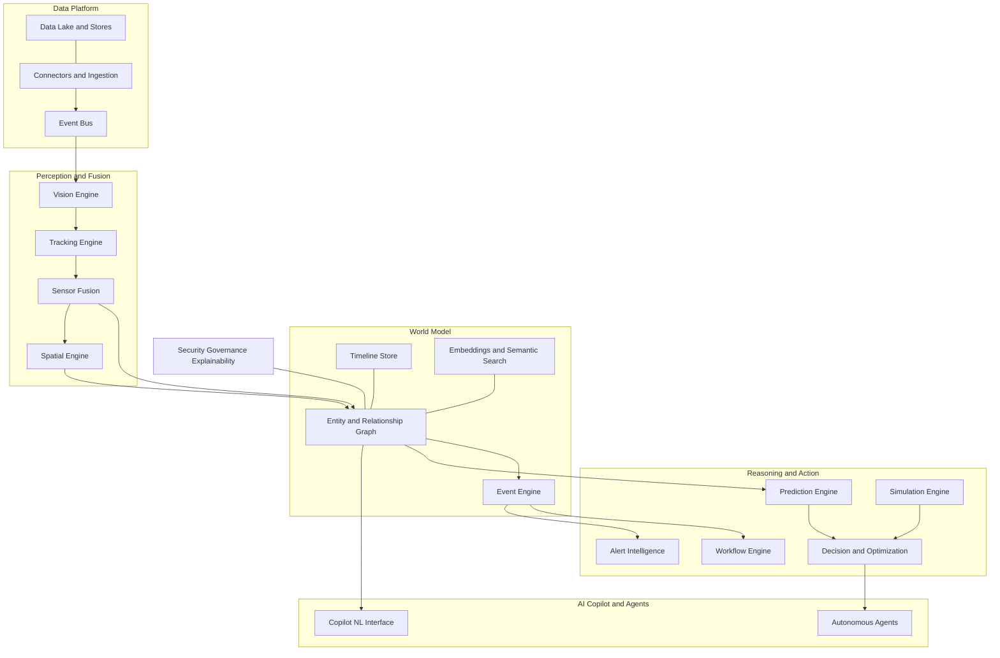
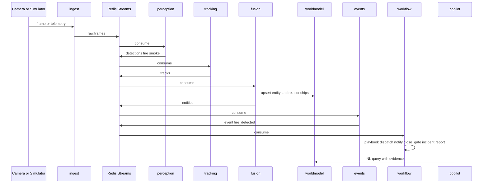

## Document Control

- Document version: 0.1 (Draft)
- Status: For review
- Owner: Manav Patel
- Last updated: 2026-07-24
- Related artifacts: implementation plan (phased roadmap), repository scaffold (pending).

---

## 1. Executive Summary

SIO is an AI operating system for understanding, tracking, predicting, and orchestrating the physical world. It ingests heterogeneous real-world signals (cameras, GPS, drones, radar, IoT, satellite, enterprise systems, public APIs), fuses them into a single live world model (a spatiotemporal knowledge graph), reasons over that model (prediction, simulation, decision, agents), and exposes it through a natural-language copilot, autonomous agents, workflows, and a live digital twin.

The strategic thesis: build one reusable platform, not many vertical products. Every application — smart city, ports, warehouses, disaster response, industrial safety, public safety, defense — is a configuration of the same substrate. This is the leverage model of Palantir Foundry/Gotham and Anduril Lattice.

Positioning: the operating system for real-world intelligence.

---

## 2. Vision, Mission, Principles

- Vision: a single platform where physical entities, sensors, events, and decisions intersect and become queryable, explainable, and actionable in real time.
- Mission (MVP horizon): deliver a runnable, end-to-end vertical slice on a laptop (no GPU) that demonstrates sensor to world model to copilot to action to explanation, with clean seams to scale to GPU/production.

Product principles:

1. Platform over product. Every feature is a reusable primitive.
2. Explainable by default. No black-box decisions; every answer carries evidence, confidence, sources, timeline.
3. Real-time first. Streaming nervous system, not batch.
4. Swappable seams. CPU-first local components swap to GPU/production components with zero API changes.
5. Governance as runtime. Privacy, RBAC/ABAC, audit, lineage enforced in the pipeline, not in docs.
6. Offline-tolerant. Designed to degrade gracefully (DDIL) as we scale to edge.

---

## 3. Goals and Non-Goals

### 3.1 Goals

- G1: Ingest multi-modal simulated and real signals into a unified event bus.
- G2: Perceive (detect/track/segment) and fuse signals into unified entities.
- G3: Maintain a live spatiotemporal world model (graph + vector + geospatial + time-series).
- G4: Detect events, predict near-future state, recommend actions, and run automated workflows.
- G5: Expose a natural-language copilot and autonomous agents over the world model.
- G6: Provide a live map/timeline/digital-twin UI with full replay.
- G7: Enforce security, privacy, audit, and explainability throughout.
- G8: Run entirely locally via Homebrew (no Docker), CPU-first, with a GPU swap path.

### 3.2 Non-Goals (for MVP)

- NG1: Not building all 22 modules to production depth in one pass.
- NG2: Not shipping face recognition in MVP (legal risk; behind governance flag, disabled by default).
- NG3: Not targeting a specific classified/air-gapped deployment yet.
- NG4: Not building custom foundation models; use open pretrained models.
- NG5: No multi-tenant billing/marketplace in MVP.

---

## 4. Target Users and Personas

- P1 Operator/Analyst: monitors the live picture, investigates incidents, asks the copilot questions, acknowledges alerts.
- P2 Commander/Supervisor: assigns missions, approves autonomous actions, reviews KPIs and replays.
- P3 Integrator/Developer: connects new sensors, writes rules/workflows/agents, uses SDKs/APIs.
- P4 Data/ML Engineer: manages models, labeling, retraining, drift.
- P5 Admin/Compliance: manages tenants, roles, policies, audit logs, retention.

---

## 5. Representative Use Cases

Vertical-agnostic; MVP demo target is generic site monitoring.

- UC1: "Show every truck that entered today and stayed more than 15 minutes." Copilot query over graph + timeline.
- UC2: Fire/smoke detected, triggering a workflow: dispatch drone, notify security, close gate, create incident, generate report.
- UC3: "Which camera last saw entity X?" Spatial + timeline + graph traversal with evidence.
- UC4: Predict congestion/next-location for tracked entities; recommend rebalancing resources.
- UC5: Scrub the timeline backward/forward to replay an incident like a video editor.
- UC6: Anomaly detected that no rule described, surfaced as a prioritized, explained alert.

---

## 6. System Architecture

### 6.1 Layered architecture



### 6.2 Runtime data flow (fire-detection scenario)



---

## 7. Module Requirements (M1-M22)

Each module lists: Purpose / Inputs / Outputs / Key capabilities / MVP scope / Acceptance criteria.

### M1 Universal Connector Platform

- Purpose: onboard any external signal source.
- Inputs: RTSP/CCTV/IP/drone/mobile/traffic cameras; satellites (Sentinel, Landsat, Planet, Maxar); drones (DJI, PX4, MAVLink); GPS (vehicles, phones, wearables, ships, aircraft); IoT (temperature, humidity, pressure, RFID, BLE, LoRa, UWB, power); enterprise (SAP, Salesforce, Slack, GitHub, Jira, ERP, CRM, databases); public APIs (weather, maps, earthquake, flight, marine, traffic, emergency).
- Outputs: normalized events on the bus with a common envelope (source, type, timestamp, geo, payload, confidence).
- Key capabilities: pluggable connector interface, schema mapping, backpressure, replay.
- MVP scope: sensor simulator (cameras/GPS/IoT) + optional RTSP via GStreamer + one weather API connector.
- Acceptance: `just seed` produces continuous multi-source events visible on the bus and UI.

### M2 Data Lake

- Purpose: durable store of everything (raw + derived), nothing discarded.
- Inputs: raw video/images/audio/LiDAR/radar, PDF/CSV/JSON/docs, sensor streams, logs, telemetry.
- Outputs: addressable, queryable objects + tables; every frame searchable.
- Key capabilities: object storage, retention/tiering policies, lineage tags.
- MVP scope: MinIO for raw media; Postgres for structured/derived; frame index in pgvector.
- Acceptance: any ingested frame retrievable by id and by semantic search.

### M3 AI Vision Engine

- Purpose: extract structured perception from imagery/audio.
- Capabilities: detection (person, vehicle, truck, animal, boat, drone, weapon, fire, smoke, tree, building, road, container, helmet, uniform, crane, equipment); segmentation (roads, floods, fire, forest, buildings, river, crop, construction); pose (walking, running, fighting, falling, working); OCR (plates, container IDs, signs, labels, docs, screens); face (gated, off by default); audio (gunshot, explosion, glass, speech, scream, vehicle, animal).
- MVP scope: YOLO26-nano (ONNX/CPU) detection + segmentation on sample clips; PaddleOCR for plates/IDs; PANNs/YAMNet audio sound-event detection; SAM 3.1 optional (CPU-heavy) behind a flag.
- Acceptance: detections emitted with class, bbox, confidence, source, timestamp.

### M4 Tracking Engine

- Purpose: persistent identity across time, occlusion, and cameras.
- Capabilities: single- and cross-camera tracking, re-appearance, occlusion handling, next-location prediction, confidence, trajectory, identity persistence.
- MVP scope: BoxMOT (ByteTrack default; BoT-SORT for moving cameras); single-camera in MVP, cross-camera stubbed (GPU: DeepStream MV3DT).
- Acceptance: stable track ids with a HOTA-oriented evaluation harness; tracks stream emitted.

### M5 Sensor Fusion

- Purpose: merge multiple observations of the same real object into one entity.
- Capabilities: time synchronization, spatial alignment, duplicate removal, sensor confidence weighting, conflict resolution.
- MVP scope: Python EKF (FilterPy) + association rules across camera/GPS/IoT; calibration via config.
- Acceptance: N observations of one object collapse to one entity with fused state + provenance.

### M6 Spatial Intelligence Engine

- Purpose: everything has coordinates and spatial relationships.
- Capabilities: lat/long/alt, building/room/floor/region/country; proximity, nearest, coverage, blind-spot queries.
- MVP scope: PostGIS queries (within radius, nearest, contains) + H3 indexing.
- Acceptance: "trucks within 500m", "nearest hospital", "cameras covering Gate B" answerable.

### M7 World Model

- Purpose: the heart, a live graph of entities and relationships.
- Entities: person, vehicle, drone, building, road, bridge, hospital, camera, sensor, company, country, machine, animal.
- Relationships: owns, visited, contains, connected_to, seen_by, transporting, communicated_with, assigned_to, entered, exited.
- MVP scope: Neo4j graph + pgvector embeddings; bitemporal edges for replay.
- Acceptance: entities/relationships upserted from fusion; graph traversal APIs live.

### M8 Timeline Engine

- Purpose: nothing deleted; every event replayable and scrubbable.
- MVP scope: append-only event log (Postgres + Redis Streams); UI scrubber; time-window queries.
- Acceptance: scrub backward/forward reconstructs world state at any timestamp.

### M9 Event Engine

- Purpose: detect meaningful events from streams.
- Capabilities: unauthorized entry, fire, speeding, crowd gathering, machine stopped, power failure, forced door, person fell, abandoned package, suspicious meeting; plus unsupervised anomaly detection.
- MVP scope: Bytewax stream CEP for rule-based events + a simple anomaly detector (PyOD/river).
- Acceptance: events emitted with type, entities, evidence, confidence.

### M10 Prediction Engine

- Purpose: forecast near-future state.
- Targets: next location, fire spread, traffic, flood, machine failure, crime hotspot, crowd density, drone battery, warehouse congestion, hospital demand.
- MVP scope: StatsForecast/TimesFM-small (CPU) for time-series; trajectory extrapolation from tracks.
- Acceptance: forecasts stored with horizon + confidence intervals.

### M11 Simulation Engine

- Purpose: what-if scenario analysis.
- Scenarios: bridge collapse, airport closure, flood level, drone battery death, machine breakdown.
- MVP scope: SimPy/Mesa discrete-event and agent-based sims; GPU: Cosmos 3 generative worlds.
- Acceptance: run a scenario, get projected impact on entities/KPIs.

### M12 Decision Engine

- Purpose: recommend actions, not just predict; explain why.
- Actions: move drone, deploy ambulance, evacuate sector, close gate, increase security, delay shipment.
- MVP scope: OR-Tools for assignment/routing + LLM rationale generation.
- Acceptance: each recommendation includes ranked options, expected effect, and explanation.

### M13 AI Copilot

- Purpose: natural-language interface over the world model.
- MVP scope: LangGraph agent + Ollama (OpenAI-compatible) with MCP tools querying graph/vector/time-series/spatial; GPU: Nemotron 3.
- Acceptance: UC1-UC4 answerable with cited evidence.

### M14 Autonomous Agents

- Purpose: continuous Observe, Reason, Decide, Act, Learn loops.
- Agents: security, logistics, drone, fire, medical, border, warehouse, construction, traffic.
- MVP scope: 2-3 agents (security, logistics) as scheduled LangGraph loops with human-on-the-loop approval gates.
- Acceptance: agent proposes actions; requires approval before acting in MVP.

### M15 Workflow Engine

- Purpose: durable, multi-step response playbooks.
- MVP scope: Temporal workflows (dispatch drone, notify, close gate, incident, report), retriable and crash-safe.
- Acceptance: fire event triggers full playbook with visible step-by-step progress.

### M16 Alert Intelligence

- Purpose: prioritize, group, deduplicate, escalate, explain urgency.
- MVP scope: alert service with severity scoring, dedup window, grouping by entity/location.
- Acceptance: duplicate alerts suppressed; escalation on unacknowledged critical alerts.

### M17 Mission Control

- Purpose: multi-user operations, assign missions, live tracking, objectives, resources, comms, progress, replay.
- MVP scope: basic missions CRUD + assignment + live status; replay via timeline.
- Acceptance: create mission, assign resource, watch live, replay.

### M18 Digital Twin

- Purpose: live model of the environment (2D maps to 3D city/factory/airport/warehouse/campus/hospital).
- MVP scope: 2D live map (MapLibre + deck.gl) updating in real time; GPU/later: CesiumJS 3D + OpenUSD/Omniverse.
- Acceptance: entities render and move live on the map.

### M19 Analytics

- Purpose: KPIs, heatmaps, movement analysis, utilization, risk, trends, forecasts, reports.
- MVP scope: Grafana dashboards + a few in-app charts.
- Acceptance: dwell-time, throughput, and heatmap views populated.

### M20 Explainable AI

- Purpose: every answer includes evidence, confidence, source sensors, timeline, related entities, alternative hypotheses.
- MVP scope: a standard explanation object attached to copilot answers, events, and decisions.
- Acceptance: any answer expands to show its evidence chain.

### M21 Security and Governance

- Purpose: multi-tenant, RBAC + ABAC, audit logs, data lineage, encryption, secrets, compliance, immutable event history.
- MVP scope: Keycloak (auth) + OPA/OpenFGA (authz) + Presidio (PII redaction, faces/plates blurred by default) + append-only audit log.
- Acceptance: unauthorized queries blocked; PII redacted; all actions audited.

### M22 Developer Platform

- Purpose: platform as infrastructure, REST, GraphQL, SDKs (Python, TS, Go), webhooks, plugin system, custom models/agents, rules engine, no-code workflow builder, simulation APIs.
- MVP scope: REST + GraphQL + webhooks + a documented connector/agent plugin interface + a Python SDK stub.
- Acceptance: a new connector and a new rule can be added without core changes.

---

## 8. World Data Model

### 8.1 Core envelopes (versioned, in `libs/sio_schemas`)

- Observation: `{id, source_id, modality, ts, geo{lat,lon,alt}, payload, confidence, raw_ref}`
- Detection: `{id, observation_id, class, bbox, mask_ref, confidence, ts, source_id}`
- Track: `{track_id, class, states[], confidence, source_id, start_ts, last_ts}`
- Entity: `{entity_id, type, attributes, state{geo, velocity}, provenance[], first_seen, last_seen, confidence}`
- Relationship: `{from, type, to, ts_valid_from, ts_valid_to, evidence[]}`
- Event: `{event_id, type, severity, entities[], geo, ts, evidence[], confidence, explanation}`
- Decision: `{decision_id, trigger_event, options[], chosen, rationale, expected_effect, confidence}`
- Explanation: `{evidence[], confidence, sources[], timeline[], related_entities[], alternatives[]}`

### 8.2 Stores

- Neo4j: entities + relationships (graph).
- Postgres + PostGIS: structured data, spatial, timeline, audit.
- pgvector: embeddings for semantic search / re-identification.
- Redis Streams: event bus + cache + timeline tail.
- MinIO: raw media/objects.

---

## 9. Technology Stack

### 9.1 Local (Homebrew-native, CPU-first) — verified formulae present

- Data/infra (via `brew services`): `postgresql@16`, `postgis` (3.6.4), `pgvector` (0.8.5), `redis` (8.8.1), `neo4j` (2026.06.0), `minio`, `ollama` (0.32.3, Metal-accelerated), `temporal` (1.8.1), `grafana`, `gstreamer` (1.28.5, optional RTSP).
- Tooling: `just` (task runner), `uv` (Python envs), `mprocs` (process TUI), `node` (web).
- Python libraries: FastAPI, Strawberry (GraphQL), Ultralytics/onnxruntime (YOLO26), BoxMOT, PaddleOCR, PANNs/YAMNet, FilterPy, Shapely/GeoPandas/H3, Bytewax, PyOD/river, StatsForecast/TimesFM, OR-Tools, SimPy/Mesa, LangGraph, neo4j driver, redis-py, Presidio.
- Web libraries: React + Vite + MapLibre GL + deck.gl + a charting library + a chat UI.

### 9.2 Not in Homebrew core (adjustments)

- No `timescaledb` core formula: use plain Postgres + PostGIS for MVP (Timescale via `timescale/tap` later if needed).
- No `qdrant` core formula: use pgvector inside Postgres (no separate vector DB).

### 9.3 GPU / production swap matrix (zero API change at the bus/API seams)

- perception/tracking: YOLO26-ONNX + BoxMOT to NVIDIA DeepStream 9.1 (RT-DETR, MV3DT, AutoMagicCalib) on Jetson/datacenter.
- copilot/agents: Ollama to Nemotron 3 via vLLM/SGLang/NIM.
- prediction/simulation: StatsForecast/SimPy to Cosmos 3 (Super/Nano/Edge) + Moirai-2.
- bus: Redis Streams to Kafka/Redpanda.
- graph: Neo4j to Memgraph; vector: pgvector to Qdrant/Milvus; stream CEP: Bytewax to Flink.

---

## 10. Repository and Service Architecture

```
sio/
  Justfile                      # setup, services, dev, seed, test, stop
  Procfile / mprocs.yaml        # app process orchestration
  .env.example
  README.md
  docs/PRD.md                   # this document
  libs/sio_schemas/             # shared pydantic + JSON schema contracts
  services/
    ingest/  perception/  tracking/  fusion/  worldmodel/
    events/  prediction/  simulation/  decision/  copilot/
    agents/  workflow/  alerts/  api/  governance/
  web/                          # React + Vite (map, timeline, copilot, missions)
  infra/                        # db init sql, neo4j constraints, grafana dashboards
  tests/                        # unit + integration + e2e scenario tests
```

- Every service: an isolated `uv` project, a `main.py`, a bus consumer/producer, a health endpoint, and a README.
- Inter-service contract: Redis Streams topics `raw.*`, `detections`, `tracks`, `entities`, `events`, `forecasts`, `decisions`, `alerts`, `audit`.

---

## 11. API Specification

- REST (FastAPI): `/entities`, `/entities/{id}`, `/tracks`, `/events`, `/timeline?from&to`, `/spatial/nearby`, `/missions`, `/alerts`, `/decisions`, `/health`.
- GraphQL (Strawberry): world-model queries + subscriptions for live updates.
- WebSocket/SSE: live entity/event stream to the UI.
- MCP tools (for copilot/agents): `graph_query`, `semantic_search`, `spatial_query`, `timeseries_query`, `timeline_replay`, `run_simulation`, `propose_decision`.
- Webhooks: outbound event/alert notifications.

---

## 12. Frontend Specification

- Live Map (default): entities/tracks/events on MapLibre + deck.gl layers; click for entity detail + provenance.
- Timeline Scrubber: play/pause/scrub; world state reconstruction; event markers.
- Copilot Panel: NL chat; answers render evidence, confidence, sources, related entities, alternatives (M20).
- Alerts Inbox: prioritized/grouped alerts; acknowledge/escalate.
- Missions / Mission Control: create/assign/track/replay.
- Analytics: dashboards (dwell time, throughput, heatmaps, utilization).
- Admin: users/roles/policies/audit (M21).

---

## 13. Non-Functional Requirements

- Performance (MVP, CPU laptop): sustain simulated 10-50 events/s end-to-end; copilot answer under 10s with a local model.
- Scalability: horizontal via bus partitioning; stateless services; swap to Kafka/GPU for scale.
- Reliability: durable workflows (Temporal); at-least-once bus semantics; idempotent consumers.
- Observability: structured logs, health endpoints, Grafana metrics, trace ids across the pipeline.
- Portability: runs on macOS (Apple Silicon) via Homebrew, no Docker; Linux/GPU path documented.
- Data retention: configurable per stream; immutable audit + event history.

---

## 14. Security, Privacy, Governance, Explainability

- AuthN: Keycloak (OIDC). AuthZ: OPA (ABAC policies) + OpenFGA (relationship-based).
- Privacy: Presidio-based PII redaction in-pipeline; face/plate blurring on by default; face recognition disabled by default (feature flag + policy).
- Audit: append-only audit stream + table; every query/action/decision logged with actor + evidence.
- Lineage: provenance recorded on every entity/event/decision.
- Multi-tenancy: tenant id scoping on all data and queries.
- Compliance posture: GDPR/CCPA/BIPA-aware; retention + deletion policies; data residency config.
- Explainability (M20): mandatory explanation object on copilot answers, events, and decisions.

---

## 15. MVP Definition and Phased Roadmap

Deliverable: `just setup && just dev` brings up the full slice on a Mac with simulated sensors.

- Phase 0 — Foundations: repo, `Justfile`, `uv`/`node` setup, `libs/sio_schemas`, Homebrew service bring-up, DB init (Postgres+PostGIS+pgvector, Neo4j constraints), Redis Streams, health checks.
    - Exit: `just services` up; schema package importable; empty pipeline boots.
- Phase 1 — Skeleton that boots: `ingest` simulator, `api`, `web` live map showing simulated entities moving; timeline tail.
    - Exit: entities visibly move on the map from simulated data.
- Phase 2 — Perception to Tracking to World Model: YOLO26-ONNX on sample clips, BoxMOT tracking, fusion, Neo4j + pgvector, semantic search.
    - Exit: real detections become tracked entities in the graph; semantic frame search works.
- Phase 3 — Events + Prediction + Timeline: Bytewax CEP + anomaly detection, forecasts, full timeline scrubber + replay.
    - Exit: fire/dwell events fire; replay reconstructs incident; forecasts stored.
- Phase 4 — Copilot + Workflow + Decision + Agents + Alerts + Governance: LangGraph+Ollama copilot with MCP tools, Temporal playbooks, OR-Tools decisions, 2 agents with approval gates, alert intelligence, Keycloak+OPA+Presidio.
    - Exit: UC1-UC6 demonstrable end-to-end with explanations and audit.
- Phase 5 — GPU/production overlay: DeepStream/Nemotron/Cosmos/Kafka/Memgraph/Qdrant swap configs; CesiumJS 3D twin; docs.
    - Exit: documented, config-driven swap to GPU components.

---

## 16. Success Metrics / KPIs

- Time-to-first-insight: from raw signal to entity in the graph (target under 2s local).
- Copilot answer accuracy on a fixed eval set (UC1-UC4).
- Track identity stability (HOTA on a sample benchmark).
- Event precision/recall on labeled demo scenarios.
- Workflow completion rate and mean time-to-response for playbooks.
- Setup friction: fresh Mac to running demo in one `just setup` (target under 20 min excluding model downloads).

---

## 17. Risks and Mitigations

- R1 Scope explosion (22 modules): mitigate via a strict phased MVP slice; depth later.
- R2 CPU performance ceiling: use nano/ONNX models, simulated data, sampling; GPU swap ready.
- R3 Cross-camera tracking hardness: defer to DeepStream MV3DT on GPU; single-camera in MVP.
- R4 Legal exposure (face rec/tracking): off by default; governance runtime; documented policy.
- R5 Homebrew drift/version breaks: pin versions; `just doctor` health check.
- R6 Model licensing: prefer Apache/OpenMDW/permissive; document each model license.
- R7 Data volume/cost: retention/tiering from day one; MinIO local.

---

## 18. Testing and QA

- Unit tests per service (schemas, transforms, consumers).
- Integration tests across bus seams (produce/consume contracts).
- End-to-end scenario tests (fire playbook, dwell-time query) via `just test`.
- Eval harness for perception (mAP), tracking (HOTA), copilot (scenario Q&A).

---

## 19. Assumptions and Open Questions

Assumptions (correct any):

- A1: MVP vertical = generic site monitoring (cameras + GPS + IoT on a facility).
- A2: Python for backend services, React/TypeScript for web.
- A3: Neo4j from the start (vs. Postgres-only graph), flagged as an open question.
- A4: Redis Streams as the MVP bus (Kafka available as upgrade).
- A5: Local single-node; no multi-tenant billing in MVP.

Open questions:

- Q1: Neo4j from Phase 0, or Postgres-relational graph first and Neo4j in Phase 2?
- Q2: Any specific first vertical to bias the demo toward (warehouse, ports, campus, traffic)?
- Q3: Include SAM 3.1 segmentation in MVP despite CPU cost, or defer to the GPU phase?

---

## 20. Glossary

- Entity: a unified real-world object in the world model.
- Fusion: merging multiple observations into one entity.
- World Model: the live spatiotemporal knowledge graph.
- DDIL: Denied, Degraded, Intermittent, Limited-bandwidth operation.
- Explanation Object: standard evidence/confidence/sources/timeline/alternatives bundle.
- Seam: a swappable boundary (bus topic or API) enabling CPU-to-GPU component swaps.

---

## Appendix A — Decisions taken during implementation

Recorded here so the PRD and the code do not drift. Rationale for each lives in
`docs/ARCHITECTURE.md` and in the commit that introduced it.

**Open questions, resolved (2026-07-24):**

- **Q1 (Neo4j timing):** Neo4j is the default graph backend from Phase 0, but behind a
  `GraphStore` port with `neo4j`, `postgres` and `memory` adapters. The demo gets real Cypher
  traversal; tests and CI never need a JVM. This also makes the §9.3 "Neo4j → Memgraph" swap a
  configuration change rather than a rewrite.
- **Q2 (first vertical):** a logistics yard / distribution centre — gates, dock doors, yard
  lanes, trucks, forklifts, perimeter. It serves UC1 (truck dwell > 15 min), UC2 (fire playbook
  and gate closure), UC3, UC4 and UC5 directly while staying generic site monitoring per A1.
- **Q3 (SAM 3.1):** deferred to the GPU phase. `yolo26n-seg.onnx` (11 MB) provides real instance
  segmentation on CPU in the MVP; SAM sits behind `SIO_ENABLE_SAM=false`.

**Deviations from §9.1, with reasons:**

1. `libs/sio_core` added alongside `libs/sio_schemas`: ports/adapters, service runtime,
   telemetry, explanation builder. Without it every service re-implements the same consumer
   loop, health endpoint and backend branching.
2. **No PyTorch, PaddlePaddle or TensorFlow anywhere in the default install.** Ultralytics
   publishes pre-exported ONNX weights, so detection (`yolo26n.onnx`, 25 ms/frame on a laptop
   CPU), segmentation, ReID (512-d) and CLIP all run on onnxruntime alone. Install size drops
   from several gigabytes to ~45 MB of models, and the GPU swap becomes an execution-provider
   string.
3. **RapidOCR (ONNX) instead of PaddleOCR** as the default OCR engine, for the same reason.
   PaddleOCR remains an optional extra.
4. **Own ByteTrack implementation** over the ONNX ReID seam instead of BoxMOT by default;
   BoxMOT's install path pulls in torch. `Tracker` keeps BoxMOT and DeepStream MV3DT as drop-ins.
5. **Bytewax is an optional CEP runtime** (`SIO_CEP_RUNTIME=native|bytewax`); the default is a
   native async consumer so rules are plain, unit-testable functions.
6. **Audio SED uses an ONNX AudioSet AST model** rather than PANNs/YAMNet (both of which need
   torch or TensorFlow), behind `SIO_ENABLE_AUDIO=false`.
7. **Keycloak, OPA and OpenFGA are optional external providers.** The default is a locally
   signed dev JWT plus an embedded evaluator interpreting the same policy documents, so
   authentication and authorisation are always on and always tested.
8. **uv workspace rather than sixteen isolated virtualenvs.** Each service is still its own uv
   project with its own dependencies; they share one lockfile for development speed, and
   `uv sync --package sio-<service>` still produces an isolated environment.
9. **Linux is supported additionally** for CI and verification. macOS/Homebrew remains the
   primary, default path; every Linux branch is gated behind `uname` and `just check` depends on
   no Linux-only tooling.
